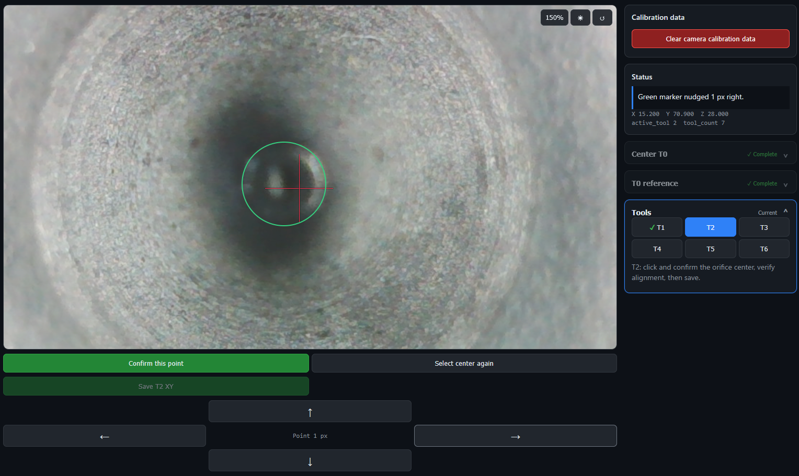

# INDX Aim & Click

**Aim at the center of the nozzle, click, and fine-tune the marker for pixel-perfect precision.**

Calibrate every INDX tool by clicking the center of its nozzle in the live camera image.

Pick a tool, click the nozzle orifice, confirm the marker, and the calibrator moves the tool into
alignment. Save the result and continue with the next tool—no pixel measurements, calculator, or
manual XY offset entry required.



The calibrator is a browser-based XY offset setup tool for a Bondtech INDX tool changer running
Klipper or Kalico. Its full 2×2 image-to-machine calibration accounts for a camera that is rotated,
mirrored, scaled differently on X and Y, or slightly skewed.

## Features

- Click the nozzle center to calculate and apply its XY correction automatically.
- Calibrate T1 through the final configured tool with the same click-confirm-save workflow.
- Guided T0 reference and image-axis calibration.
- Supports camera rotation, inversion, unequal X/Y scale and shear.
- Reads the tool count from `gcode_macro TOOL_POSITIONS.tool_count`.
- Verifies each saved XY offset by reading it back from Klipper variables.
- Includes brightness, contrast, gamma, zoom, crosshair-size and point-circle-size controls that do
  not affect calibration.

## Requirements

- Klipper or Kalico with Moonraker.
- Bondtech INDX configuration exposing:
  - `gcode_macro TOOL_POSITIONS.tool_count`
  - `CAL_ONE_SET_CAMERA_REF`
  - `CAL_TWO_PREP_TOOL_CAL TOOL=<number>`
  - `CAL_THREE_SAVE_XY_OFFSET`
- A browser-accessible MJPEG nozzle-camera stream. The default URL is
  `/webcam/?action=stream`.
- The calibrator and Moonraker should normally be served from the same host. If they are not, the
  web server and Moonraker must allow the required cross-origin requests.

> [!IMPORTANT]
> Update your [BondtechAB/INDX](https://github.com/BondtechAB/INDX) configuration to the latest
> `main` branch before using Aim & Click. It requires the current calibration macro names and the
> XY offset save fix included in PRs
> [#63](https://github.com/BondtechAB/INDX/pull/63) and
> [#64](https://github.com/BondtechAB/INDX/pull/64).

## Safety

Back up `variables.cfg` and your INDX configuration before calibrating.

Verify tool pickup, parking, homing and camera clearance manually before using this UI. T0 manual
XYZ positioning is not limited to 5 mm because it is used to reach an initially unknown camera
position. The UI shows the complete move and requires confirmation first, with an additional warning
at Z 25 mm or lower. Click-to-align tool correction remains XY-only and limited to a total of 5 mm.

Keep access to Moonraker and this page restricted to trusted users on your local network.

## Installation

### Automatic installation (recommended)

Connect to the Raspberry Pi with SSH, then run:

```bash
cd ~
git clone --depth 1 https://github.com/spi-ntech/indx-aim-and-click.git
cd indx-aim-and-click
chmod +x install.sh
./install.sh
```

The installer detects `~/mainsail` or `~/fluidd`, copies the application into the existing web
directory, and prints the address to open.

To update later:

```bash
cd ~/indx-aim-and-click
git pull --ff-only
./install.sh
```

To remove it:

```bash
cd ~/indx-aim-and-click
./install.sh uninstall
```

If the installer cannot find the web directory automatically, pass it explicitly:

```bash
./install.sh install /home/pi/mainsail
```

After installation, open this path using the same hostname or IP address as Mainsail or Fluidd:

```text
http://<printer-host>/nozzlecam-calibrator/
```

For example: `http://mainsailos.local/nozzlecam-calibrator/`

No separate web server or nginx editing is required when the detected Mainsail/Fluidd web root is
used.

### Manual or custom installation

Copy `index.html`, `css`, `js` and `media` into a `nozzlecam-calibrator` folder inside the active web
root. Keep the calibrator on the same hostname as Moonraker and the camera stream unless CORS has
been configured explicitly.

Optional query parameters:

- `camera=<URL>` — override the camera stream URL.
- `moonraker=<URL>` — override the Moonraker base URL.

## Calibration workflow

1. Home the printer and make sure the tool changer operates normally.
2. Open the calibrator and select **Clear camera calibration data** when starting a new camera setup.
3. Select **Pick T0 and move to camera**. If a camera position is already stored, T0 moves there.
   If no camera position exists yet, the calibrator picks T0, homes Z when necessary, and waits for
   manual positioning instead of moving to an unknown coordinate.
4. If the nozzle is outside the camera image, enter an approximate camera X, Y and Z position in the
   manual controls and select **Move to XYZ**. Use the jog controls for final positioning anywhere
   inside the dashed region, then select **Confirm T0 position**.

   > [!WARNING]
   > Check the entered Z coordinate and the complete motion path before moving. Use a clearance-safe
   > Z position so the nozzle, toolhead and camera mount cannot collide.
5. Click the T0 nozzle-orifice center in the camera image, check the green marker, and select
   **Confirm this point**.
6. Run the recommended **1.0 mm** image-axis calibration and click the orifice center after each
   move. If the orifice leaves the image, select **Abort axis calibration** and retry with 0.5 or
   0.25 mm.
7. Select T1, click its orifice center, check the green marker, and select **Confirm this point**.
   The nozzle moves into alignment with the red T0 crosshair automatically.
8. Verify the alignment, then select **Save T1 XY**. If the click was wrong, select
   **Select center again** to undo the correction and repeat the click before saving.
9. Repeat for the remaining tools. A green check means the save and read-back verification
   succeeded.

The page warns before moving to T0 or another tool when the current correction has not been saved.

## Browser data and privacy

The public build stores only the following data in browser local storage:

- T0 image reference.
- Image-to-machine calibration matrix.
- Camera display preferences.
- Saved-tool check indicators.

No camera images or motion-diagnostic records are saved or uploaded by this build. Actual tool
offsets are stored by the existing INDX save macro, not by browser local storage.
